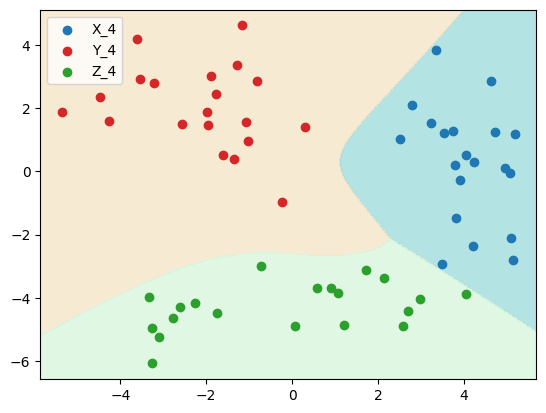

# Classification with Convex Optimization

This project demonstrates how to solve a classification problem using convex optimization techniques. Unlike traditional approaches that rely on machine learning algorithms and packages like Sklearn, this project builds classifiers from scratch, providing clear, step-by-step explanations.

## Overview

The project uses a Jupyter notebook to guide you through the process of creating classifiers using only NumPy, CVXPY, and Matplotlib. Each section of the notebook corresponds to a different part of the classifier construction process. The methods used in this project are based on "Section 8.6 Classification" of the reference book [1].

## Dependencies

- NumPy
- CVXPY
- Matplotlib

## Usage

To use this project, clone the repository and run the Jupyter notebook. Make sure you have all the dependencies installed.

## Example results

## Reference
$[1]$ Stephen Boyd and Lieven Vandenberghe. Convex optimization. Cambridge university press.
